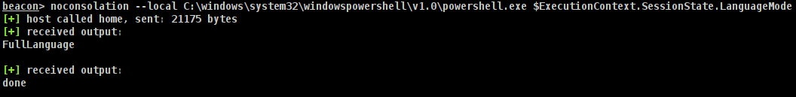

# No-Consolation

This is a Beacon Object File (BOF) that executes unmanaged PEs inline and retrieves their output without allocating a console (i.e. spawning `conhost.exe`).  



## Features
- Supports 64 and 32 bits
- Supports EXEs and DLLs
- Does not create new processes
- Does not create new threads
- Links modules to the PEB
- Saves binaries in memory
- Supports C++ exceptions (x64 only)
- Custom loads all dependencies

## Usage
```
Summary: Run an unmanaged EXE/DLL inside Beacon's memory.

Usage: noconsolation [--local] [--inthread] [--link-to-peb] [--dont-unload] [--timeout 60] [-k] [--method funcname] [-w] [--no-output] [--alloc-console] [--close-handles] [--free-libraries wininet.dll,winhttp.dll] [--dont-save] [--list-pes] [--unload-pe pename] [--load-all-dependencies] [--load-all-dependencies-but advapi32.dll] [--load-dependencies wininet.dll] [--search-paths C:\Windows\Temp\] /path/to/binary.exe arg1 arg2
    --local, -l                                    Optional. The binary should be loaded from the target Windows machine
    --inthread, -it                                Optional. Run the PE with the main thread. This might hang your beacon depending on the PE and its arguments.
    --link-to-peb, -ltp                            Optional. Load the PE into the PEB
    --dont-unload, -du                             Optional. If set, the DLL won't be unloaded.
    --timeout NUM_SECONDS, -t NUM_SECONDS          Optional. The number of seconds you wish to wait for the PE to complete running. Default 60 seconds. Set to 0 to disable
    -k                                             Optional. Overwrite the PE headers
    --method EXPORT_NAME, -m EXPORT_NAME           Optional. Method or function name to execute in case of DLL. If not provided, DllMain will be executed
    -w                                             Optional. Command line is passed to unmanaged DLL function in UNICODE format. (default is ANSI)
    --no-output, -no                               Optional. Do not try to obtain the output
    --alloc-console, -ac                           Optional. Allocate a console. This will spawn a new process
    --close-handles, -ch                           Optional. Close Pipe handles once finished. If PowerShell was already ran, this will break the output for PowerShell in the future
    --free-libraries, -fl DLL_A,DLL_B              Optional. List of DLLs (previously loaded with --dont-unload) to be offloaded
    --dont-save, -ds                               Optional. Do not save this binary in memory
    --list-pes, -lpe                               Optional. List all PEs that have been loaded in memory
    --unload-pe PE_NAME, -upe PE_NAME              Optional. Unload from memory a PE
    --load-all-dependencies, -lad                  Optional. Custom load all the PE's dependencies
    --load-all-dependencies-but, -ladb DLL_A,DLL_B Optional. Custom load all the PE's dependencies except these
    --load-dependencies, -ld DLL_A,DLL_B           Optional. Custom load these PE's dependencies
    --search-paths, -sp PATH_A,PATH_B              Optional. Look for DLLs on these paths (system32 is the default)

    /path/to/binary.exe                   Required. Full path to the windows EXE/DLL you wish you run inside Beacon. If already loaded, you can simply specify the binary name.
    ARG1 ARG2                             Optional. Parameters for the PE. Must be provided after the path

    Example: noconsolation --local C:\windows\system32\windowspowershell\v1.0\powershell.exe $ExecutionContext.SessionState.LanguageMode
    Example: noconsolation /tmp/mimikatz.exe privilege::debug token::elevate exit
    Example: noconsolation --local C:\windows\system32\cmd.exe /c ipconfig
    Example: noconsolation --list-pes
    Example: noconsolation LoadedBinary.exe args
```

## Loading binaries into memory
Binaries are automatically encrypted and stored in memory after they are ran the first time. This means that you do not need to constantly send the binary over the wire.  
To execute a binary that has already been saved in memory, simply specify its name instead of its entire path. So, instead of running:
```
beacon> noconsolation --local C:\windows\system32\cmd.exe /c ipconfig
```
You would run:
```
beacon> noconsolation cmd.exe /c ipconfig
```

To list all binaries loaded in memory, run `--list-pes`.  
If you are done with some binary and wish to unload it, run `--unload-pe mimikatz.exe`.  
Finally, if you want to run a binary without it being automatically loaded in memory, run it with `--dont-save`.  


## Loading PE's dependencies
You can avoid all image load events by custom loading all the PE's depdendencies:
```
beacon> noconsolation --load-dependencies --link-to-peb /tmp/malware.exe
```
After execution is completed, the PE and its dependencies will be offloaded automatically.  
DLLs that use Thread Local Storage are not supported.  


## Credits
- [Octoberfest7](https://twitter.com/octoberfest73) for [Inline-Execute-PE](https://github.com/Octoberfest7/Inline-Execute-PE) which was my inspiration for this project
- [modexp](https://twitter.com/modexpblog) and [TheWover](https://twitter.com/TheRealWover) for the PE load logic from [donut](https://github.com/TheWover/donut)
- [rad9800](https://twitter.com/rad9800) for his [HWBP engine](https://github.com/rad9800/hwbp4mw)
- [batsec](https://twitter.com/_batsec_) for [DarkLoadLibrary](https://github.com/bats3c/DarkLoadLibrary)
- [aidankhoury](https://twitter.com/aidankhoury) for [ApiSet](https://github.com/ajkhoury/ApiSet)
- [bb107](https://github.com/bb107) for [MemoryModulePP](https://github.com/bb107/MemoryModulePP)
